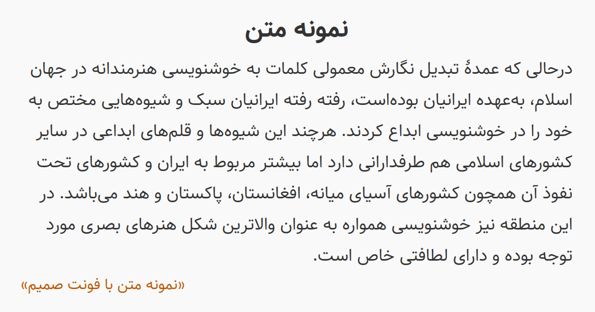

<h1 dir="rtl" align="center">
  <a href="http://rastikerdar.github.io/samim-font/">Samim Font</a>
</h1>

<p dir="rtl" align="right">
  A Persian (Farsi) Font &mdash; فونت (قلم) فارسی صمیم
</p>


[](https://badge.fury.io/js/samim-font)

<p dir="rtl" align="right">فونت فارسی صمیم</p>
<p dir="rtl" align="right">
  <a href="https://rastikerdar.github.io/samim-font">نمایش فونت - صفحه رسمی پروژه</a>
</p>

<p dir="rtl" align="right">
  <a href="https://github.com/rastikerdar/samim-font/releases">صفحه دریافت (دانلود) بسته فونت شامل فایل های ttf,woff,eot</a>
</p>

<p dir="rtl" align="right">
  با تشکر از برنامه
  <a href="https://fontforge.github.io">FontForge</a>
</p>

<p dir="rtl" align="right">
  بر مبنای فونت
  <a href="https://rastikerdar.github.io/vazir-font">فونت وزیر</a>
</p>

<p dir="rtl" align="right">
  نسخه‌های بدون حروف لاتین یا تمام ارقام فارسی درون بسته فشرده موجود است.  
</p>
<p dir="rtl" align="right">
  فرآیند تولید بسته نهایی شامل انواع نسخه‌ها و فرمت‌ها توسط ابزار
  <a href="https://github.com/rastikerdar/fontbuilder">fontbuilder</a>
  .انجام می‌شود
</p>

 <h2 dir="rtl" align="right">نمونه متن Sample</h2>
 


<h2 dir="rtl" align="right">طریقه استفاده در صفحات وب</h2>

<p lang="fa" dir="rtl" align="right">
کد زیر را در قسمت style یا فایل css وارد نمایید:
</p>


```css
@font-face {
  font-family: Samim;
  src: url('Samim.eot');
  src: url('Samim.eot?#iefix') format('embedded-opentype'),
       url('Samim.woff2') format('woff2'),
       url('Samim.woff') format('woff'),
       url('Samim.ttf') format('truetype');
  font-weight: normal;
}

@font-face {
  font-family: Samim;
  src: url('Samim-Bold.eot');
  src: url('Samim-Bold.eot?#iefix') format('embedded-opentype'),
       url('Samim-Bold.woff2') format('woff2'),
       url('Samim-Bold.woff') format('woff'),
       url('Samim-Bold.ttf') format('truetype');
  font-weight: bold;
}

@font-face {
  font-family: Samim;
  src: url('Samim-Medium.eot');
  src: url('Samim-Medium.eot?#iefix') format('embedded-opentype'),
       url('Samim-Medium.woff2') format('woff2'),
       url('Samim-Medium.woff') format('woff'),
       url('Samim-Medium.ttf') format('truetype');
  font-weight: 500;
}
```

## Install

Grab the [latest release](https://github.com/rastikerdar/samim-font/releases/latest) file.

#### bower

```shell
bower install samim-font --save
```

#### npm

```shell
npm install samim-font
```

#### [RawGit](https://rawgit.com) CDN

```html
<link href="https://cdn.rawgit.com/rastikerdar/samim-font/v[X.Y.Z]/dist/font-face.css" rel="stylesheet" type="text/css" />
```

Replace [X.Y.Z] with the latest version (e.g. 4.0.5) and integrate the font into your CSS:

```
font-family: 'Samim', sans-serif;
```

#### Arch Linux

Arch user's could use [samim-fonts](https://aur.archlinux.org/packages/samim-fonts/) package from [AUR](https://aur.archlinux.org/) repository to install samim font. Use your favourite [AUR helper](https://wiki.archlinux.org/index.php/AUR_helpers) like pacaur or yaourt for installing package:

```shell
pacaur -S samim-fonts
```

#### GNU/Linux
gnu/linux users could use [kateb](https://github.com/kiamazi/kateb) font manager, to install samin font.

```
kateb install samim
or
kateb update samim
```

## Contributors

- Allen Bargi [aziz](https://github.com/aziz)
- Farzan Balkani [artlesshand](https://github.com/artlesshand)

## License
SIL Open Font License Version 1.1  
Copyright &copy; 2015, Saber Rastikerdar [rastikerdar](https://github.com/rastikerdar)
